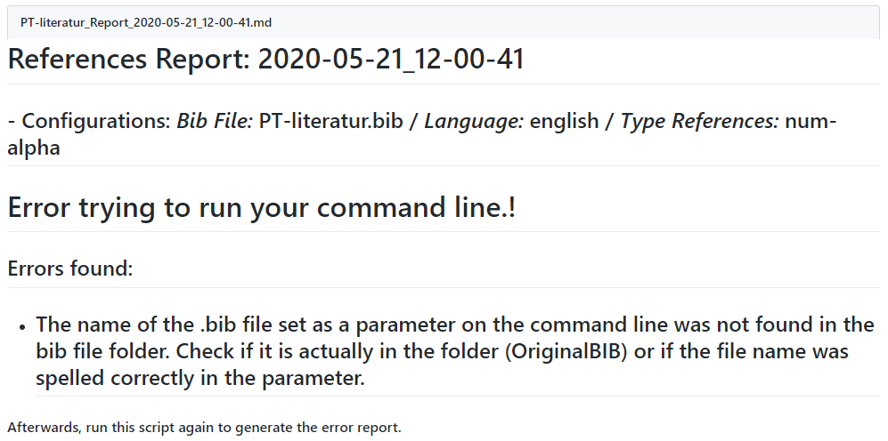
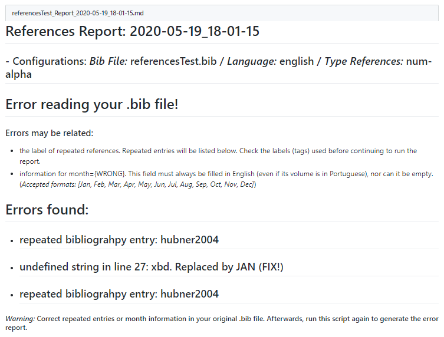
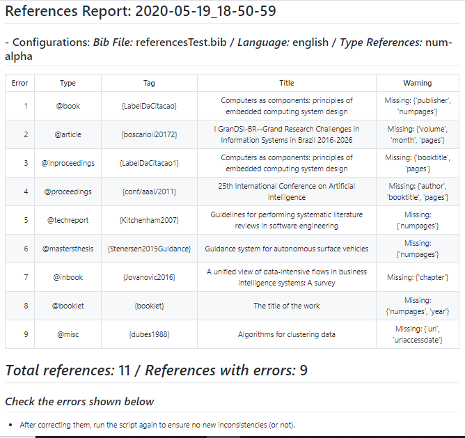
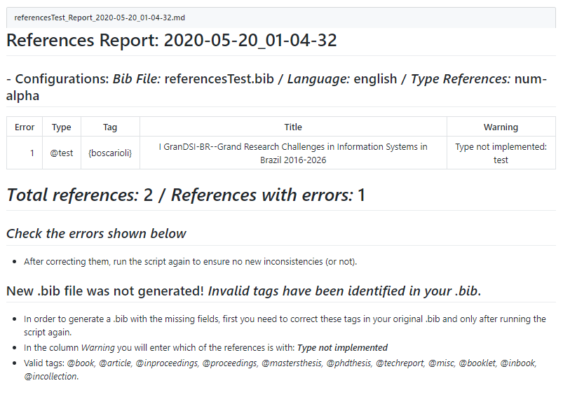
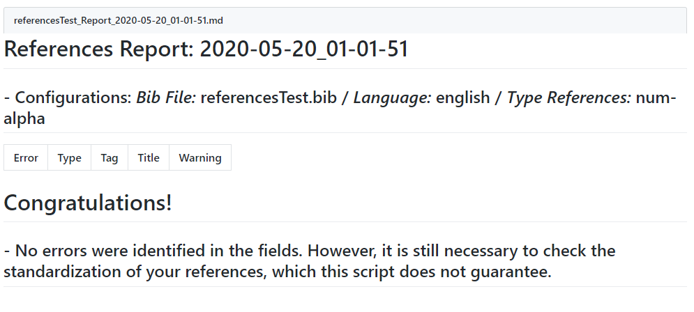

[](https://colab.research.google.com/github/olimarborges/GenerateReportBib/blob/master/GoogleColab_GRB.ipynb)

# Generate Report Bib (GRB)

Este projeto é uma iniciativa do atual Representante Discente do Programa de Pós-graduação em Ciência da Computação (PPGCC/PUCRS) **[Olimar Teixeira Borges](https://github.com/olimarborges)**, que visa auxiliar na padronização das Referências Bibliográficas utilizadas nas Dissertações de Mestrado e Teses de Doutorado do PPGCC.

No entanto, após o uso deste script, não significará uma garantia de que seu `arquivo.bib` está totalmente correto. Não isentando o(a) pesquisador(a) de verificar a adequação de suas referências com a padronização seguida pelo PPGCC/PUCRS. Mas ele servirá como uma forma de auxílio durante o processo de verificação das suas referências bibliográfias.

No momento, as verificações programadas neste projeto seguem a padronização definida no documento [Formatos de Monografias, Dissertações e Teses do PPGCC](http://www.pucrs.br/politecnica-prov/wp-content/uploads/sites/166/2018/10/padrao_teses_dissertacoes_monografias_PPGCC_18102018.pdf), como também o [Documento Auxiliar](https://github.com/ppgcc/DocumentosPPGCC) criado pelo mesmo representante discente. Ele não está configurado para verificar as adequações em relação às bibliografias utilizadas em templates da ACM, IEEE, Springer e etc.

**ATENÇÃO:** Antes de fazer o download deste projeto, leia a seção [Utilização](#utilização).

## Tabela de Conteúdos

- [Utilização](#utilização)
- [Resumo das Funcionalidades](#resumo-das-funcionalidades)
- [Configuração do Ambiente Python](#configuração-do-ambiente-python)
  - [Ambiente Virtual Python](#ambiente-virtual-python)
    - [Configurando o Ambiente](#configurando-o-ambiente)
- [Dependências do Projeto](#dependências-do-projeto)
- [Entendendo o GRB](#entendendo-o-GRB)
- [Utilizando o GRB](#utilizando-o-GRB)
  - [Possíveis Situações de Relatórios de Erros](#possíveis-situações-de-relatórios-de-erros)
    - [Erro nos parâmetros do script](#erro-nos-parâmetros-do-script)
    - [Erro no arquivo.bib](#erro-no-arquivo.bib)
  - [Principais Relatórios](#principais-relatórios)
    - [Relatório com os Avisos](#relatório-com-os-avisos)
    - [Novo arquivo.bib](#novo-arquivo.bib)
      - [Lembre-se](#lembre-se)
    - [Relatório 'PARA-BÉNS'](#relatório-'PARA-BÉNS')
- [Agradecimentos](#agradecimentos)
- [Contribuindo](#contribuindo)

## Utilização

Você pode optar por fazer o uso deste projeto de duas formas:
1. Fazer o download deste repositório (ou clone) em seu ambiente (computador). Desta forma, você precisará realizar toda a configuração e instalação de pacotes listadas nas próximas duas seções:
    - [Configuração do Ambiente Python](#configuração-do-ambiente-python)
    - [Dependências do Projeto](#dependências-do-projeto)
2. Ou você pode utilizar a versão criada no Google Colab. Desta forma, a execução ficará dentro do ambiente do Colab e você NÃO precisará fazer download ou clone deste projeto para a sua máquina. Para esta versão, clique no botão `Open in Colab`, localizado no topo deste README.md. A partir desta escolha, para entender o funcionamento deste projeto, você pode ir direto para as seções:
    - [Entendendo o GRB](#entendendo-o-GRB)
    - [Utilizando o GRB](#utilizando-o-GRB)

## Resumo das Funcionalidades

Resumidamente, as principais funcionalidades desse script são:

- Gerar relatórios informativos sobre a adequação do seu `arquivo.bib` em relação às regras de padronização definidas no documento de Formatos de Monografias, Dissertações e Teses do PPGCC.
- Geração de um `novo_arquivo.bib` (baseado no seu `arquivo.bib` de referências orginal) com as seguintes correções:
  - serão inseridos os campos faltantes junto à palavra 'MISSING'. Por exemplo, se o script identificar que para a sua referência 'X', do tipo '@article', a informação do 'mês' for obrigatória e no seu `arquivo.bib` original a tag 'month' não constar, o script irá regerar essa referênicia 'X', adicionando a tag `month='MISSING'`. Desta forma, basta abrir o `novo_arquivo.bib` gerado, procurar pelas palavras 'MISSING' e no lugar, inserir a informação correta referente àquela citação.
  - retira a informação de ano, caso ela conste nos nomes das conferências, jornals, editoras de livros e etc. Existe um campo específico para a informação de ano `year={}`, portanto ela não tem que se repetir junto aos nomes dos eventos. As tags que passam por esta verificação são: `{publisher, journal, booktitle, school e institution}`.
  - para as palavras acrônimas ('IEEE', 'ACM', ..., por exemplo), que constam nos nomes das conferências, jornals, editoras de livros e etc., são inseridas chaves `{ }` na determinada palavra, quando ela já não possuir. Isso serve para que quando o LaTeX for compilar, ele não retire o 'formato uppercase' da palavra. Caso contrário, mesmo que no seu `arquivo.bib` a palavra estiver correta (`ACM`, por exemplo), quando o LaTeX compilar, ele vai gerar `Acm`. Por isso a necessidades do uso das chaves `{ }`, nestas palavras. As tags que passam por esta verificação são: `{publisher, journal, booktitle, school e institution}`.
  - realiza a capitalização dos campos referentes aos nomes das conferências, jornals, editoras de livros e etc. As tags que passam por esta verificação são: `{publisher, journal, booktitle, school e institution}`. No entanto, há uma restrição de funcionamento correto somente aos nomes escritos nos idiomas `português`, `inglês`, `espanhol` e `alemão`. Pois o script precisa realizar o uso e download de `STOPWORDS` do determinado idioma. Estes idiomas foram configurados, por terem sido os mais identificados nos testes realizados com os `arquivos.bib` enviados para testes por demais colegas do PPGCC.

Ressaltanto que estas verificações podem se comportar de maneira inesperada, caso as informações que constem nas tags não estejam adequadas. Por exemplo, se o nome da conferência `Proceedings of the ACM/IEEE International Conference on Software Engineering`, estiver escrita de forma incorreta, com palavras unidas, por exemplo: `Proceedings of the ACM/IEEEInternational Conference on SoftwareEngineering`, a verificação vai considerar como se fosse apenas uma palavra, resultando em `Proceedings of the Acm/ieeeinternational Conference on Softwareengineering`.

Além disso, caso alguma palavra 'stopword' esteja com a identificação de acentuação (por exemplo: `n{\~a}o`), ela não será caracterizada como tal (stopword) e portanto sofrerá capitalização (`N{\~a}o`). Por este e outros motivos, sempre consulte o relatório gerado e verifique as mensagens. Pois nestes exemplos, haverão informações de que estas conferências não estavam com seu nome capitalizado. E portanto, acesse o `novo_arquivo.bib` e verifique se o script realizou a capitalização de forma adequada. Isso vale para todas as correções listadas acima, que o script realiza de forma automatizada.

## Configuração do Ambiente Python

Para que você possa executar este projeto, será necessário ter instalado em sua máquina o `Python3` com o gerenciador de pacotes `pip`. Se você já possui o ambiente configurado, pode pular este tópico.

### Ambiente Virtual Python

Para quem ainda não tem instalado o Python3, sugiro fazer uso do `virtualenv`. É uma forma de criar ambientes virtuais para o uso do Python, com o objetivo de deixar as modificações e pacotes em um ambiente local e não global, evitando assim, 'bagunçar' as configurações originais do seu ambiente Python, além de não deixar 'sujeira' de configurações e pacotes instalados. Você pode configurar vários ambientes virtuais, de acordo com o que tiver desenvolvendo e desta forma, os pacotes instalados ficam específicos para cada ambiente.

#### Configurando o Ambiente

Os passos descritos a seguir, foram executados na minha máquina (Windows 10) e em uma VM Linux (Ubuntu 19.10). No entanto, para cada computador, poderá haver nuâncias que não serão contempladas nestas simples instruções.

Instale o Python3 (com o `pip`) seguindo os passos de acordo com o seu Sistema Operacional (SO):

- [Linux](https://python.org.br/instalacao-linux/)
- [MacOS](https://python.org.br/instalacao-mac/)
- [Windows](https://python.org.br/instalacao-windows/)

Com o Python3 e o `pip` devidamente instalados, abra o Terminal do seu SO e inicie o processo de criação do seu ambiente virtual. Primeiro instale o pacote para criar os ambientes virtuais:
```
pip install virtualenv
```

Em seguida, crie uma pasta para armazenar as suas máquinas virtuais (você pode fazer a criação da pasta pela interface gráfica do seu SO, se preferir):
```
C:\Users\user\Desktop> mkdir <virtualenv>
```
Substitua `<virtualenv>` pelo nome da pasta. Neste exemplo, a pasta será `virtualenv`. Lembre-se do caminho aonde você está com a linha de execução do seu Terminal (`C:\Users\user\Desktop`, por exemplo).

Crie um ambiente virtual para executar o Python:
```bash
C:\Users\user\Desktop> virtualenv virtualenv\virtual_1
```

Ative o ambiente virtual:
```bash
virtualenv\virtual_1\Scripts\activate
```

Agora, antes da linha de comando, aparecerá um flag `(virtual_1)` dizendo que você está usando o virtualenv 'virtual_1':
```bash
(virtual_1) C:\Users\user\Desktop>
```
A partir daqui, você pode começar a instalar as bibliotecas que desejar. Para este projeto, vamos fazer uso do gerenciador `pip` para instalar alguns pacotes.

## Dependências do projeto

Neste momento, acesse o local aonde o projeto foi baixado, por exemplo:

```bash
(virtual_1) C:\Users\user\Desktop> cd GenerateReportBib
(virtual_1) C:\Users\user\Desktop\GenerateReportBib>
```

Para que o projeto funcione, antes você precisa instalar alguns pacotes. Para facilitar este processo, execute o comando abaixo que ele importará todos os pacotes de uma só vez:

```bash
(virtual_1) C:\Users\user\Desktop\GenerateReportBib> pip install -r requirements.txt
```

* Os pacotes listados no `requirements.txt` foram suficientes para que o projeto funcionasse no Windows 10 e no Ubuntu 19.10, no entanto, ao executar o GRB, caso seja necessário a instalação de mais algum pacote, aparecerá listado no Terminal, o seu respectivo nome. A partir dele, faça a instalação utilizando o `pip`.

Em seguida instale o pacote de `stopwords` da biblioteca `NLTK`. Este pacote serve para fazer a verificação e correção de capitalização nos campos referentes a nomes de connferências, journals, editoras e etc:

```bash
(virtual_1) C:\Users\user\Desktop\GenerateReportBib> python -m nltk.downloader stopwords
```

## Entendendo o GRB

Se todos os passos anteriores foram executados sem problemas, você já pode fazer uso deste projeto.

Antes de iniciar, preste bastante atenção na estrutura de pastas do projeto. Ela é importante para que o funcionamento do script ocorra de maneira correta. Entenda a organização de pastas:

- *OriginalBIB:* É nesta pasta que você deve inserir o seu `arquivo.bib` original.
- *GenerateReports:* É nesta pasta que os relatórios com a listagem dos erros encontrados do seu `arquivo.bib` serão apresentados. A cada nova execução do script, um novo relatório será gerado com a data e horário da execução.
- *GenerateBIB:* É nesta pasta que os novos arquivos .bib serão gerados. Após a execução do script, caso o seu bib não esteja com problemas de compilação, será gerado um `novo_arquivo.bib` aqui, com a mesma data e horário do relatório correspondente a mesma execução.
- *screenshots:* Pasta com as imagens de exemplos que constam neste arquivo `README.md`.

Dentro das pastas seguem arquivos utilizados para testar o funcionamento do script. Depois de tudo configurado, você pode executar o script sem realizar nenhuma alteração e deve ser gerado um `relatório.html` e um `novo_arquivo.bib` com as informações de teste.

O arquivo principal `grb.py` é o script que realiza todo o processamento e verificações do seu `arquivo.bib`.

Para fazer uso do GRB você não precisa mexer no script. A sua edição só é estimulada, caso pretenda contribuir com melhorias e refatorações no código. Caso contrário, qualquer mudança pode ocasionar mal funcionamento na geração dos `relatórios de erros` e do `novo_arquivo.bib`.

## Utilizando o GRB

Para fazer uso do script, inicialmente copie o seu `arquivo.bib` para dentro da pasta `OriginalBIB`.

A partir desse momento, será necessário configurar alguns parâmetros que serão utilizados para executar o script. Preencha os parâmetros corretamente, seguindo as restrições de preenchimento especificadas a seguir:

- **<arquivo.bib>:** Preencha com o nome do seu `arquivo.bib` original que precisa, obrigatoriamente, estar localizado na pasta `OriginalBIB`.",

- **<idioma>:** Idioma da sua Dissertação ou Tese. Para PORTUGUÊS utilize: `pt` / Para INGLÊS utilize: `en`)",

- **<tipo>:** Tipo das suas referências. Para estilos NUM ou ALPHA utilize: `num` ou `alpha` / Para o estilo APALIKE utilize: `apa`"

Com os parâmetros devidamente configurados, você já pode fazer a execução do script. Para isso, abra o Terminal na linha de comando do seu projeto e execute o script substituindo os valores `<parametro>` pelas suas informações:

```bash
(virtual_1) C:\Users\user\Desktop\GenerateReportBib>python grb.py <arquivo.bib> -L <idioma> - T <tipo>
```

Exemplo de execução:
```
python grb.py referencesTest.bib -L en -T apa
```

As tags `-L` e `-T` precisam ser especificadas junto com a execução, pois elas identificam a linguagem (idioma: pt ou en) da sua dissertação ou tese e o tipo dela (num , alpha ou apa), respectivamente.

Por exemplo, se após a execução do script aparecer no seu Terminal mensagens parecidas com:

```
LANGUAGE:  en
TYPE_REFERENCES:  apa
FILE_NAME:  referencesTest.bib
Exporting to referencesTest_Report_2020-05-20_19-20-39.html
```

Isso significa que o script executou sem problemas. No entanto, isso não indica que o processo encerra aqui.

Dependendo de como estiver o seu `arquivo.bib`, os primeiros relatórios servirão para que você arrume alguns detalhes do seu `arquivo.bib` e execute novamente o script.

O script gera mais de um tipo de relatório, portanto, para verificar quais foram os problemas encontrados, acesse a pasta `GenerateReports` e busque pelo arquivo `report.html`. O nome do relatório é gerado com a data e horário da execução do script, por exemplo: `_Report_2020-05-19_15-11-05.html`.

Por padrão, este arquivo é gerado com extensão `.html` dentro da pasta `GenerateReports`. No entanto, se no momento da conversão para `.html`, o `arquivo.bib` original estiver em uma codificação diferente de `utf-8`, será apresentado um erro no console do Terminal (especificando o/os caracter(es) que não foram identificados pela codificação `utf-8`). Desta forma, o relatório ainda será gerado, só que não mais no formato `.html`, mas sim no formato `.md (markdown)`, na mesma pasta dos relatórios: `GenerateReports`.
  - *Sugestão:* caso seja gerado o arquivo em formato `.md`, você pode utilizar a ferramenta [`Visual Studio Code (VSC)`](https://code.visualstudio.com/) para abri-lo. Depois que abrir o arquivo no VSC, procure por um botão com uma lupa, localizado no canto superior direito, que o arquivo será apresentado no formato visual 'compilado'.

### Possíveis Situações de Relatórios de Erros

Neste tópico, serão apresentados algumas situações que podem gerar erro na execução do script. No entanto, podem não ser as únicas.

#### Erro nos parâmetros do script

Enquanto os parâmetros da execução do script não forem preenchidos corretamente, conforme instruções e restrições acima, o script não funcionará. Será apresentado no console algumas mensagens informando quais parâmetros ele está esperando. Além disso, caso o `arquivo.bib` definido na linha de comando não for válido, o seguinte relatório de erro pode ser gerado:



#### Erro no arquivo.bib

Caso o seu `arquivo.bib` esteja com algum problema, o script ficará gerando relatórios de erros (com mensagens específicas do determinado problema), até que o mesmo seja corrigido. Possíveis problemas no `arquivo.bib`, encontrados durante os testes, que geram problemas:

- Quando há labels de referências repetidos, como por exemplo `(olimar2020)`:

```
@article{olimar2020,
  title={Título},
  author={Borges, Olimar Teixeira},
  journal={Journal},
  volume={30},
  pages={389-406},
  month={Mar},
  year={2020}
}

@inproceedings{olimar2020,
  title={Título},
  author={Borges, Olimar Teixeira},
  booktitle={Booktitle},
  pages={389-406},
  year={2020}
}
```

- Os labels programados neste script para serem verificados são: _`@book, @article, @inproceedings @proceedings, @mastersthesis, @conference, @phdthesis, @techreport, @misc, @booklet, @inbook, incollection`_. Qualquer outro label de referência que estiver dentro do `arquivo.bib`, gerará um relatório de erro específico. Esta restrição se deve, pois são estes labels que estão definidos na padronização utilizada no documento de referências do PPGCC. Demais tags não são previstas, portanto, não são tratadas. Para que o script funcione, sugiro retirar ou atualizar por lables válidos, dentro do `arquivo.bib` e executar novamente o script.

Veja um exemplo de relatório que não gera o `novo_arquivo.bib`, devido a alguns dos erros mencionados anteriormente:



### Principais Relatórios

Quando tudo ocorrer de acordo, ao executar o script, você conseguirá emitir relatórios de erros que servirão como auxílio para a correção das suas referências. Entenda os relatórios para que eles possam realmente ajudar você nesse processo de correção.

#### Relatório com os Avisos

Este relatório é o principal deste projeto! Ele é gerado quando não há mais erros nos parâmetros e nem no `arquivo.bib`.

Neste relatório será apresentado as validações que o script realizou. Para cada uma das referências do `arquivo.bib`, que for identificada alguma inconsistência, será listada a referência e o aviso correspondente. No coluna `Warning` consta as descrições destes avisos, que devem ser corrigidos. Veja o screenshot de exemplo de um relatório de avisos final:



Entenda alguns dos possíveis `Warnings` que poderão ser gerados em seu relatório:

- _Type not implemented:_: Este erro é `muito importante`, pois ele IMPEDE que seja gerado o `novo_arquivo.bib`, enquanto o(is) label(s) que não são válidos, não forem retirados ou atualizados por labels válidos.
  - **Dica:** Antes de iniciar as correções em seu `arquivo.bib`, corrija estes 'problemas' do tipo `Type not implemented`, deixando apenas os labels válidos e execute o script novamente. Desta forma, o `novo_arquivo.bib` também será gerado e você poderá começar a usá-lo!
  - O screenshot a seguir apresenta um relatório com erro de `_New .bib file was not generated! Invalid tags have been identified in your .bib._`, que foi gerado pelo _Type not implemented:_
  

- _Failed Month and Year: year={Mon, Year} check_: Em referências no estilo `apa`, para citações do tipo `@article`, o mês e ano precisam constar juntos dentro da mesma tag `year={Mon, Year}`.
- _Failed Month month={ Mon } check_: Em referências no estilo `num` ou `alpha`, para citações do tipo `@article`, a informação de `month={}` e `year={}` também são obrigatórias, mas no entanto, devem ser inseridas em suas respectivas tags individuais.
- _The { tag } field takes no year information_: A informação do ano só deve constar dentro da tag `year={}` e não junto com o nome da Conferência ou Journal.
- _Field { tag } is not capitalized_: Os nomes das conferências, jornals, editoras e etc, devem estar capitalizados, ou seja, sempre a primeira letra de cada palavra precisa estar em maiúsculo.
- _Missing: { tags }_: As tags informadas dentro dos `{}` são de preenchimento obrigatório para a determinada citação.

#### Novo arquivo.bib

Junto com este relatório dos avisos, é gerado um `novo_arquivo.bib` (quando não ocorrerem os problemas já descritos).

Dento do `novo_arquivo.bib`, em relação aos três últimos erros listados anteriormente (_The { tag } field takes no year information_, _Field { tag } is not capitalized_ e _Missing: { tags }_),quando forem identificados, eles serão 'corrigidos' e apresentados dentro do arquivo. Em relação ao primeiro erro, o ano será retirado da informação da tag. No segundo, o nome que antes não estava capitalizado, será capitalizado. E no terceiro, as tags que estavam faltando, serão adicionadas junto ao valor `'MISSING'`. Desta forma, rapidamente será possível identificar quais tags precisam ser preenchidas com as informações obrigatórias.

Por exemplo, caso no `arquivo.bib` original conste a seguinte referência, com a configuração `en` e `num` ou `alpha`:

```
@book{LabelDaCitacao,
	title={Computers as components: principles of embedded computing system design},
	author={W. Wolf},
	year={2001},
  publisher={Morgan kaufmann publishers},
	address={New York, EUA}
}
```

No arquivo de relatório será apresentada para esta referênicia a mensagem: `Missing: {'numpages'}`. Já que os campos obrigatórios para livros no estilo `num` ou `alpha` são: `{'author', 'title', 'publisher', 'year', 'numpages'}`. Além disso, a tag `publisher` deve estar capitalizada. Desta forma, será gerado no `novo_arquivo.bib` a seguinte referência:

```
@book{LabelDaCitacao,
	title={Computers as components: principles of embedded computing system design},
	author={W. Wolf},
	year={2001},
	address={New York, EUA},
  publisher={Morgan Kaufmann Publishers},
  numpages={MISSING}
}
```

Para cada referência com campos faltantes, será gerada uma tag correspondente neste novo arquivo, com: `tag={MISSING}`.

### Relatório 'PARA-BÉNS'

Este relatório será gerado quando não houverem inconsistências definidas neste projeto. Ele não é necessariamente uma garantia de que suas referências estão totalmente de acordo. É de responsabilidade do(a) pesquisador(a) verificar suas próprias citações. A seguir, veja o screenshot deste relatório:



## Agradecimentos
Agradecimento ao colega Alumni de Mestrado do programa e amigo [Pedro Ballester](https://github.com/Ballester) pela disponibilização do código embrião deste projeto!

## Contribuindo
Se você acha este projeto útil e gostaria de contribuir com ele, fique à vontade em fazer alterações e refatorações no código e em seguida abra [pull requests](https://help.github.com/pt/github/collaborating-with-issues-and-pull-requests/creating-a-pull-request) para se tornarem parte oficial deste projeto.
